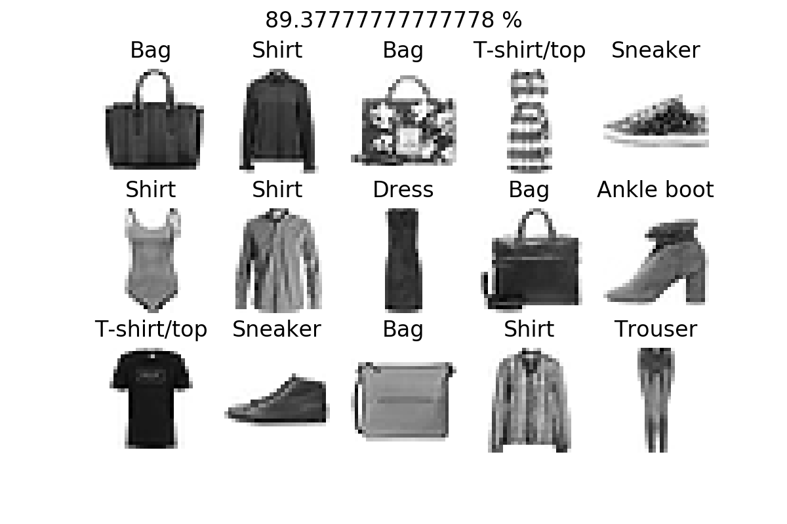

# KNN Fashion-MNIST
Implementation of k-Nearest Neighbors algorithm using [Fashion-MNIST](https://github.com/zalandoresearch/fashion-mnist)

## Optimal number of neighbors
So, to get the most optimal number of neighbors, this snippet will test each score for neighbors from 1 to `number_of_test`</br>

```python
number_of_test = 5

accuracy_list = []

for k in range(1, (number_of_test+1)):
    # determinate the knn model with 'k' neighbors
    knn = neighbors.KNeighborsClassifier(k)

    # train model with this KNN
    model = knn.fit(X_train, y_train)
    accuracy_score = 100 * model.score(X_test, y_test)

    # append error result
    accuracy_list.append(accuracy_score)
```

[See the plot](images/optimal-neighbor.png)

## Score
As you can see above, the optimal number of neighbors was 1 so, with 1 neighbor, the accuracy of model was `89.38%`</br>
Here a plot with 15 images



## License
[Apache License 2.0](https://choosealicense.com/licenses/apache-2.0/)
